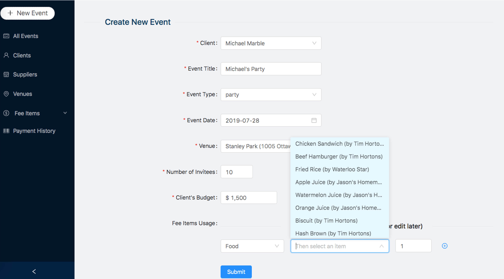
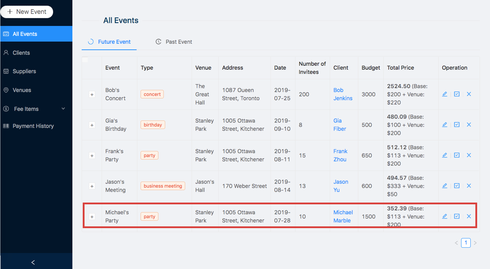
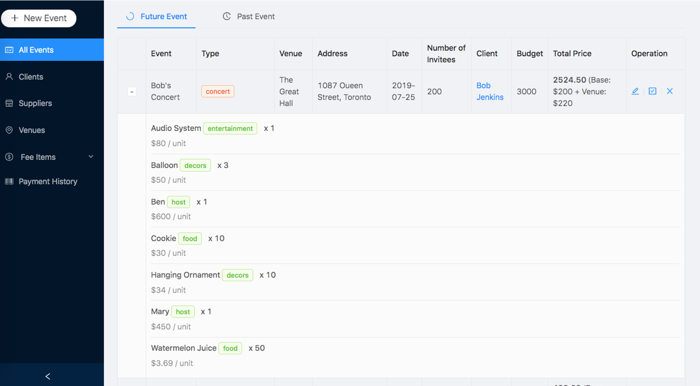
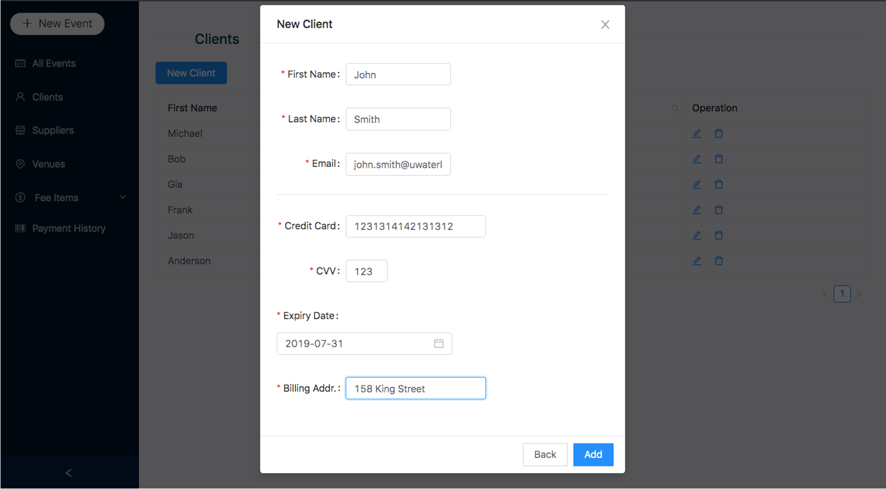
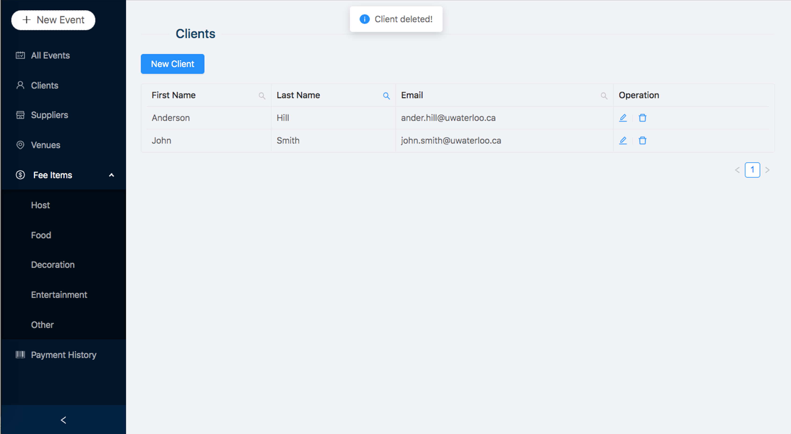
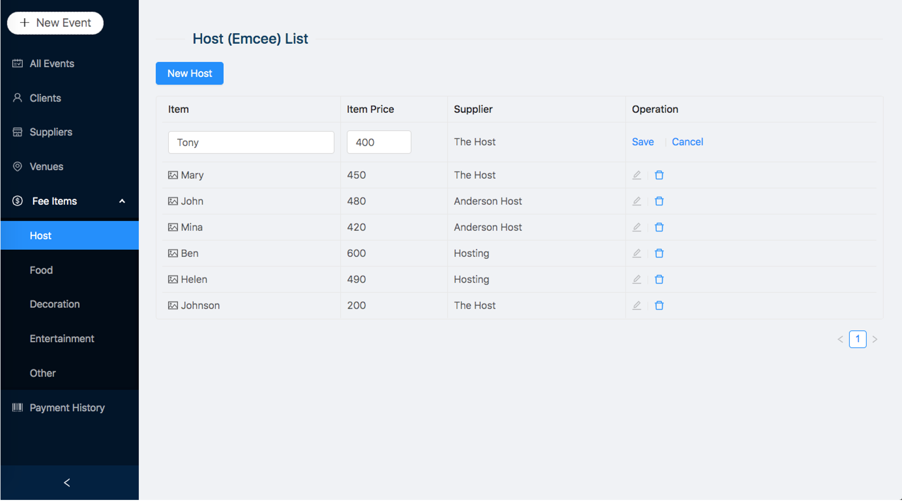

# perfect-party
Final project of CS348 | University of Waterloo (author: m224zhou, j293yu)

## Overview

An full-stack web application designed for employees at event planning company. With this web app, they are able to create, record, manage and track clients' event, and also adjust event options for clients (like locations, fee items, etc.).

Specifically, employees can read and modify detailed information about clients, events, suppliers, venues and various fee items (host, food, decoration, entertainment, other); employees can also add new or delete existing clients, events(can only add/delete future events), suppliers, venues, and fee items.

#### Create new event:

#### View all events:

#### Event details:

#### Manage clients:

#### Manage fee items:

(for more details, check MANUAL.doc)
